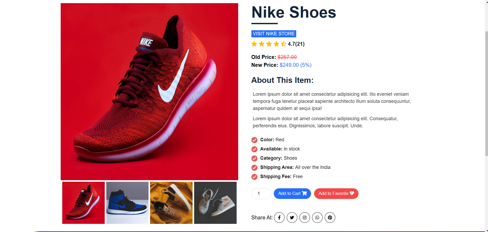
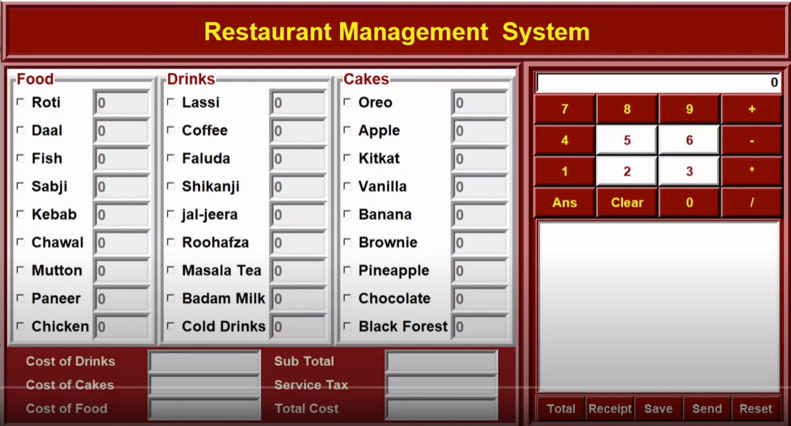

# Hi there 👋, I'm Sakthivel Madhu
<h3 align="left" width="50%" >I'm a Backend Developer</h3>

Backend developer with considerable
    technical skills who possess self-discipline
    and the ability to work with minimum
    supervision. Looking forward to join a
    progressive organization with opportunities
    to work onsignificant projects.

<a href="Sakthivel_Madhu_Resume (3).pdf" download >Download CV</a>
  

<h3 text-color="red" > Social Links : </h3>

GitHub : <a  href="https://github.com/SakthivelMadhu">SakthivelMadhu</a>

Linkedin : <a  href="https://www.linkedin.com/in/sakthivel-madhu-864647238/">SakthivelM</a>

Replit : <a href="https://replit.com/@sakthivelMadhu">Sakthivel97</a>

LeetCode : <a  href="https://leetcode.com/sakthi130597/">sakthi130597</a>

Portfolio : <a " href="https://sakthivelmadhu.github.io/">SakthivelMadhu.github.io</a>

<h3 text-color="red" padding-top="30px"> My Latest Projects :  </h3>  

Famous Footwear Clone :
<a padding-right="20px" href="https://github.com/Deepak-25yadav/wicked-edge-6587">Github</a>
<a href="https://magnificent-bonbon-8ffb8d.netlify.app/">Live</a>   

   

Naukri Clone :  
<a href="https://github.com/SakthivelMadhu/-lazy-base-8555">Github</a>
<a href="https://cerulean-tarsier-3cdce4.netlify.app/">Live</a>   

Over Stock Clone :   
<a href="https://github.com/SakthivelMadhu/next-vest-6513">Github</a>
<a href="https://roaring-licorice-c0552e.netlify.app/">Live</a>   

 
    

Restaurant Management System : 
<a href="https://github.com/SakthivelMadhu/Restaurant_management_system">Github</a>
<a href="#">Live</a>    

 

<h3 text-color="red" padding-top="30px"> GitHub's Stats :  </h3>  
  

<h3 text-color="red"> Most Used Languages :  </h3>  
 

<h3 text-color="red" > Programming Languages : </h3>

